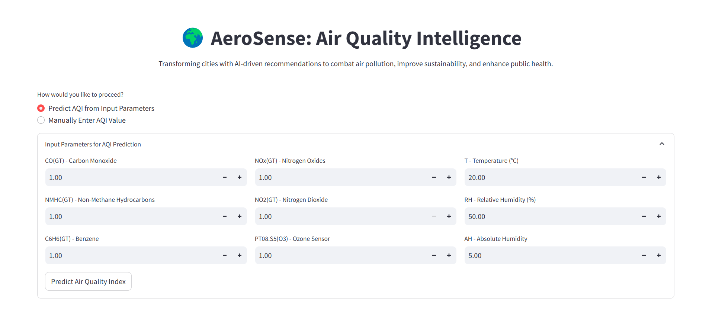
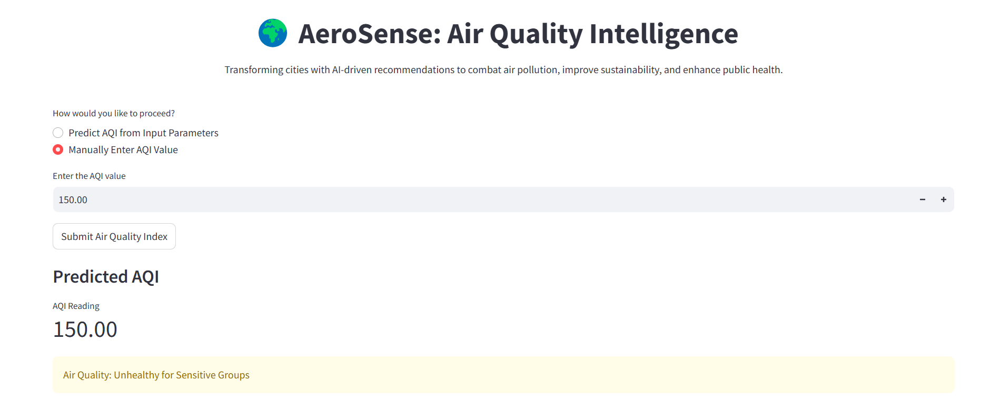
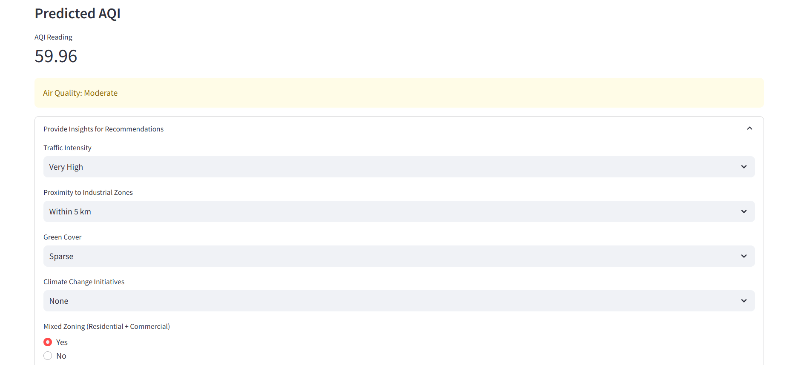
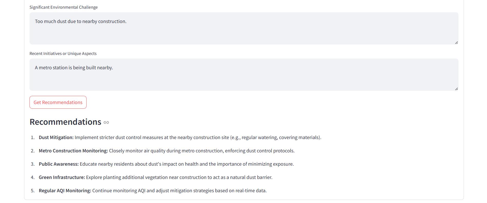

# AeroSense: Air Quality Intelligence 🌍

AeroSense is designed to predict Air Quality Index (AQI) and deliver actionable AI-driven recommendations to improve air quality, enhance sustainability, and promote public health.

## Features

- **AQI Prediction**: Predict AQI using pre-trained models (Neural Network, XGBoost, Random Forest).
- **Insights and Recommendations**: Generate detailed insights and actionable  recommendations based on AQI and environmental factors.

## Installation

1. **Clone the repository**:
    ```sh
    git clone https://github.com/samfusedbits/aerosense.git
    cd aerosense
    ```

2. **Install dependencies**:
    ```sh
    pip install -r requirements.txt
    ```

3. **Set up API Key**:
    ```sh
    API_KEY = "your_api_key_here"
    ```

## Usage

1. **Run the application**:
    ```sh
    streamlit run aerosense.py
    ```

2. **Access the application**:
    - Open your browser and go to `http://localhost:8501`.

## ScreenShots

Here are some visual snapshots of the AeroSense application:

### Main Interface


*Predict AQI from input parameters.*


*Directly input AQI for quick insights.*


### AQI Prediction

*Reliable AQI predictions using advanced machine learning models.*

### Insights and Recommendations

*Insights and actionable recommendations based on AQI and environmental factors.*


### Follow-up Questions

*Get more details about recommendations and ask follow-up questions for further clarification.*

## Live Site

You can also access the live site at [aerosense.streamlit.app](https://aerosense.streamlit.app).